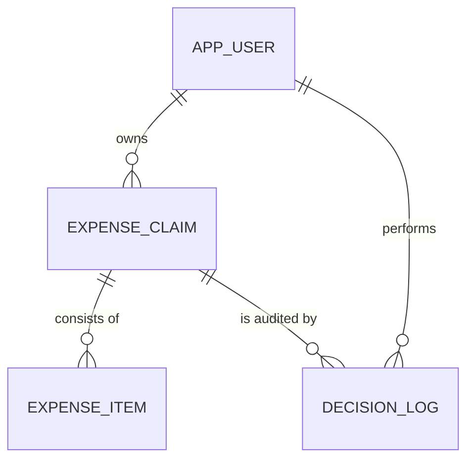

# Entity Model

## Entity Relationship Diagram

## Entities

### APP_USER

A staff member who can own expense claims and, depending on role, review or reimburse them.

| Attribute | Description                                | Data Type | Length/Precision | Validation Rules                             |
|-----------|--------------------------------------------|-----------|------------------|----------------------------------------------|
| id        | Unique identifier                          | Long      | 19               | Primary Key, Sequence                        |
| name      | Full name of the user                      | String    | 100              | Not Null                                     |
| email     | Email address of the user                  | String    | 255              | Not Null, Unique, Format: Email              |
| role      | Authorization role of the user             | String    | 20               | Not Null, Values: EMPLOYEE, MANAGER, FINANCE |

### EXPENSE_CLAIM

A request for reimbursement of business expenses, moving through a lifecycle from draft to reimbursement.

| Attribute       | Description                                        | Data Type | Length/Precision | Validation Rules                                                            |
|-----------------|----------------------------------------------------|-----------|------------------|-----------------------------------------------------------------------------|
| id              | Unique identifier                                  | Long      | 19               | Primary Key, Sequence                                                       |
| owner_id        | Employee who owns the claim                        | Long      | 19               | Not Null, Foreign Key (APP_USER.id)                                         |
| title           | Short title describing the claim                   | String    | 200              | Not Null                                                                    |
| status          | Current lifecycle status of the claim              | String    | 20               | Not Null, Values: DRAFT, SUBMITTED, APPROVED, REJECTED, REIMBURSED, Default: DRAFT |
| created_at      | When the claim was created                         | DateTime  | -                | Not Null                                                                    |
| submitted_at    | When the claim was last submitted for review       | DateTime  | -                | Optional                                                                    |
| decided_at      | When the claim was last approved or rejected       | DateTime  | -                | Optional                                                                    |
| reimbursed_at   | When the claim was reimbursed                      | DateTime  | -                | Optional                                                                    |
| decision_reason | Reason given for the most recent rejection         | String    | 1000             | Optional                                                                    |

### EXPENSE_ITEM

A single itemised expense within a claim.

| Attribute    | Description                                   | Data Type | Length/Precision | Validation Rules                                                     |
|--------------|-----------------------------------------------|-----------|------------------|-----------------------------------------------------------------------|
| id           | Unique identifier                             | Long      | 19               | Primary Key, Sequence                                                 |
| claim_id     | Claim the item belongs to                     | Long      | 19               | Not Null, Foreign Key (EXPENSE_CLAIM.id), Cascade Delete              |
| category     | Kind of expense                               | String    | 20               | Not Null, Values: TRAVEL, MEALS, ACCOMMODATION, EQUIPMENT, OTHER      |
| description  | What the expense was for                      | String    | 500              | Not Null                                                              |
| amount       | Amount of the expense in EUR                  | Decimal   | 12,2             | Not Null, Min: 0.01                                                   |
| expense_date | Date the expense was incurred                 | Date      | -                | Not Null, Not in the future                                           |
| has_receipt  | Whether a receipt is attached to the expense  | Boolean   | 1                | Not Null, Default: false                                              |

### DECISION_LOG

An audit record of one state transition performed on a claim (submission, withdrawal, approval, rejection, or reimbursement).

| Attribute   | Description                                    | Data Type | Length/Precision | Validation Rules                                                            |
|-------------|------------------------------------------------|-----------|------------------|------------------------------------------------------------------------------|
| id          | Unique identifier                              | Long      | 19               | Primary Key, Sequence                                                        |
| claim_id    | Claim the entry belongs to                     | Long      | 19               | Not Null, Foreign Key (EXPENSE_CLAIM.id), Cascade Delete                     |
| actor_id    | User who performed the action                  | Long      | 19               | Not Null, Foreign Key (APP_USER.id)                                          |
| action      | State transition that was performed            | String    | 20               | Not Null, Values: SUBMITTED, WITHDRAWN, APPROVED, REJECTED, REIMBURSED       |
| occurred_at | When the action was performed                  | DateTime  | -                | Not Null                                                                     |
| reason      | Reason given with the action (e.g. rejection)  | String    | 1000             | Optional                                                                     |
